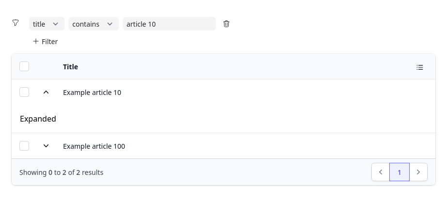

# DataTable

A flexible DataTable component for LiveView.



Some of the features the component has:
* Filtering
* Sorting
* Expandable rows
* Pagination
* Row selection with customizable bulk actions
* Data is fetched from `DataTable.Source` behaviour, usable with custom data sources
* First class Ecto `Source`
* Support for persisting sort/filter state to query string (R)
* Tailwind theme included, but fully customizable

Rows marked with R are currently undergoing a refactor, and are rough around the edges.

```elixir
def render(assigns) do
  ~H"""
  <DataTable.live_data_table
    id="table"
    source={{DataTable.Ecto.Source, {MyApp.Repo, @source_query}}}>

    <:col :let={row} name="Id" fields={[:id]} sort_field={:id}>
      <%= row.id %>
    </:col>

    <:col :let={row} name="Name" fields={[:first_name, :last_name]}>
      <%= row.first_name <> " " <> row.last_name %>
    </:col>

  </DataTable.live_data_table>
  """
end

def mount(_params, _session, socket) do
  query = DataTable.Ecto.Query.from(
    user in MyApp.User,
    columns: %{
      id: user.id,
      first_name: user.first_name,
      last_name: user.last_name
    },
    key: :id
  )

  socket = assign(socket, :source_query, query)

  [...]
end
```

## Installation

If [available in Hex](https://hex.pm/docs/publish), the package can be installed
by adding `data_table` to your list of dependencies in `mix.exs`:

```elixir
def deps do
  [
    {:data_table, "~> 0.1.0"}
  ]
end
```

### Tailwind Theme
If using the `Tailwind` theme, you must have tailwind set up for your app.
You must also:
* Configure tailwind to generate styles for the `data_table` dependency
* Include the `petal_components` css in your app

Add this to the `content` list in your `assets/tailwind.js`:
```js
"../deps/petal_components/**/*.*ex",
"../deps/data_table/**/*.*ex"
```

Add this to the end of your `assets/css/base.css`:
```scss
@import "../../deps/petal_components/assets/default.css";
```
